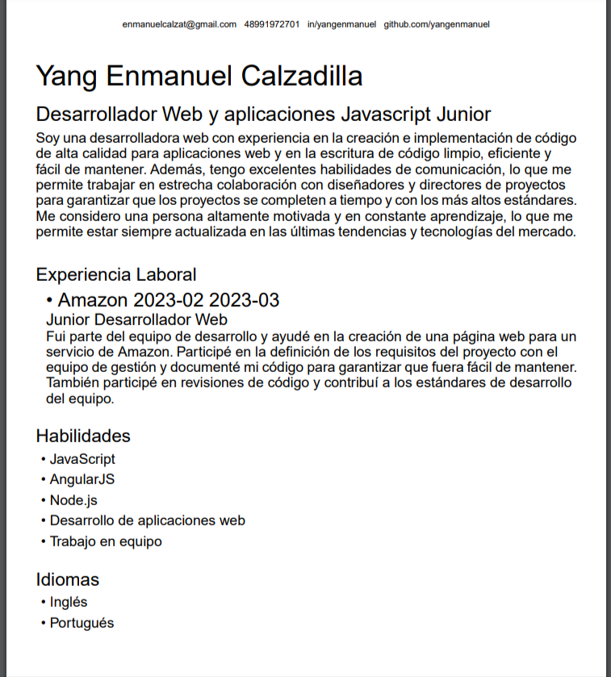

🏅 Qualified top 30 on InfoJobs Hackathon

# CV Generator with AI integration

CVGenius works with [OpenAi](https://openai.com) and [InfoJobs](https://infojobs.net) data to simplify the creation of tailored CVs. Enhance your chances of success by generating a personalized CV that matches job requirements seamlessly. Save time and present a professional profile with our AI-powered CV Generator.

## Example:


## Try it on your machine
1. Create a `.env.local` file with the following variables:

```bash
OPENAI_API_KEY=
AUTH_TOKEN=
```

To get the `OPENAI_API_KEY` you can create an account on [OpenAi](https://openai.com) and create a APi KEY.  
To get the `AUTH_TOKEN` you can create an account on [InfoJobs](https://developer.infojobs.net/) and get your credentials on Base64.  

2. Run the development server:

```bash
npm run dev
# or
pnpm dev
```

3. Open [http://localhost:3000](http://localhost:3000) with your browser to see the result.

### This project was developed during a hackathon sponsored by [InfoJobs](https://infojobs.net) stood out as one of the top projects, ranking on the top 30 best projects.